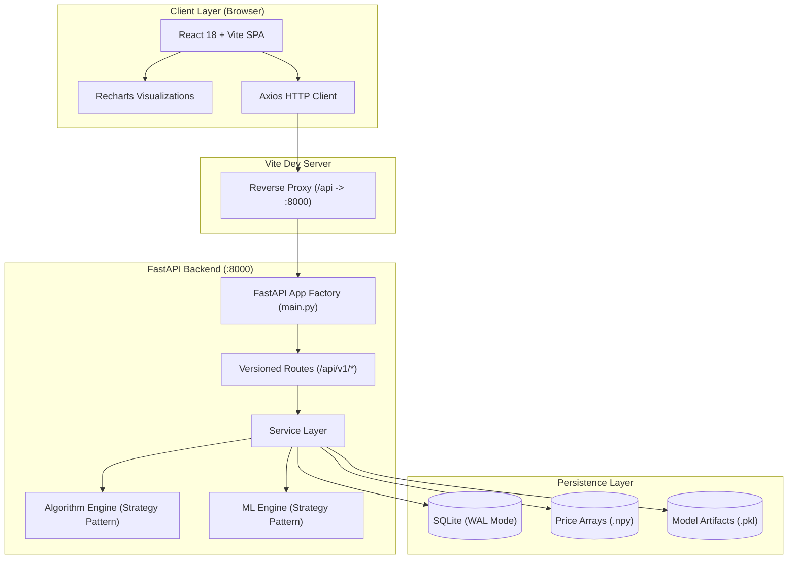

# Historic Stock Market Peak Analyzer

A full-stack academic web application that applies three maximum-subarray algorithms to stock price data, compares their empirical runtime and memory consumption against theoretical Big-O complexity, and trains machine learning models to detect anomalies, classify market regimes, and predict trading signals — all accessible via an interactive browser interface and a versioned REST API.

---

## Table of Contents

1. [Overview](#overview)
2. [Key Features](#key-features)
3. [Architecture](#architecture)
4. [Tech Stack](#tech-stack)
5. [Prerequisites](#prerequisites)
6. [Installation](#installation)
7. [Configuration](#configuration)
8. [Running Locally](#running-locally)
9. [API Reference](#api-reference)
10. [Testing](#testing)
11. [Project Structure](#project-structure)
12. [Deployment](#deployment)
13. [Contributing](#contributing)
14. [Troubleshooting](#troubleshooting)
15. [FAQ](#faq)
16. [License](#license)

---

## Overview

The Historic Stock Market Peak Analyzer addresses the classic **Buy-Low / Sell-High** single-transaction optimization problem by reducing it to the **Maximum Subarray Problem** on consecutive daily price differences:

$$
\Delta[i] = \text{prices}[i+1] - \text{prices}[i] \quad \text{for } 0 \le i < N - 1
$$

A maximum contiguous subarray in $\Delta$ from index $i$ to $j$ corresponds directly to buying at day $i$ and selling at day $j+1$, yielding maximum profit:

$$
\text{Profit} = \text{prices}[j+1] - \text{prices}[i] = \sum_{k=i}^{j} \Delta[k]
$$

The repository implements three fundamental algorithms representing distinct algorithmic paradigms:

- **Brute Force** — exhaustive search of all subarray pairs ($O(N^2)$)
- **Divide and Conquer** — recursive partitioning based on CLRS §4.1 ($O(N \log N)$)
- **Kadane's Algorithm** — dynamic programming state tracking ($O(N)$)

### Target Audience

Computer science students, researchers, and educators studying Design and Analysis of Algorithms (DAA). The system provides verifiable benchmarking, theoretical vs. empirical curve fitting, floating-point cross-verification, and machine learning extensions without external cloud or database dependencies.

---

## Key Features

- **Three Classical Subarray Algorithms**: Implemented using the Strategy Pattern with input validation, floating-point safety, and mid-range hardware execution limits.
- **Cross-Algorithm Verification**: Analysis runs automatically compare outputs across all executed algorithms; profits must agree within a tolerance of $10^{-6}$ or a mismatch warning is raised.
- **Statistical Benchmark Engine**: Executes 10 iterations per algorithm (configurable) in a worker thread (`asyncio.to_thread`) with an explicit garbage collection protocol (`gc.collect()`), recording Mean, Median, Min, Max, and Standard Deviation for execution time (seconds) and memory footprint (MB).
- **Graceful Profiling Fallback**: Benchmarks prioritize `memory_profiler` for sub-millisecond memory sampling, fall back to `psutil` RSS deltas, and gracefully record timing-only metrics if native memory profiling is unavailable.
- **Empirical Complexity Sweeps**: Automatically generates synthetic datasets across multiple sizes ($N = 1\text{k}$ to $100\text{k}$), runs benchmarks, and computes a Big-O **fitness score** ($[0.0, 1.0]$) comparing empirical doubling growth ratios against theoretical expectations.
- **Dataset Synthesis & Ingestion**:
  - Synthetic log-normal price generation (Geometric Brownian Motion) supporting 5 distribution profiles (`random`, `mostly_positive`, `mostly_negative`, `high_volatility`, `low_volatility`) with seed reproducibility.
  - CSV and XLSX file upload with case-insensitive column auto-detection (`close`, `adj_close`, `price`, `value`, `open`, `high`, `low`) and 50 MB safety limits.
- **SHA-256 Content-Addressed Caching**: Price arrays are rounded to 6 decimal places and hashed. Identical price sequences avoid redundant storage and return precomputed benchmark results instantly.
- **Largest-Triangle-Three-Buckets (LTTB) Downsampling**: Datasets with $N > 10,000$ points are automatically downsampled to $5,000$ points for frontend rendering while preserving local peaks and troughs.
- **Machine Learning Integration**:
  - `anomaly_detector` (Isolation Forest): Identifies abnormal volatility and volume shifts.
  - `regime_classifier` (K-Means): Clusters price movements into Bull, Bear, and Neutral market regimes.
  - `peak_predictor` (Gradient Boosting): Predicts Buy (+1), Hold (0), and Sell (-1) trading signals based on 7 technical indicators (RSI-14, Bollinger position, momentum, z-score, return, slope).
  - Configurable hyperparameters with server-side bounds clamping.
- **Automated Academic PDF Reports**: ReportLab Platypus engine builds downloadable multi-page PDF documents detailing price charts, algorithm tables, benchmark statistics, and complexity conclusions.
- **Self-Documenting REST API**: OpenAPI schema auto-generated from Pydantic v2 models, accessible via Swagger UI and ReDoc.

---

## Architecture

The system is structured as a decoupled full-stack application. The FastAPI backend serves a versioned JSON REST API backed by an embedded SQLite database, while the React/Vite frontend serves an interactive Single Page Application (SPA).



### Concurrency and Threading Model

- **Non-blocking API**: Computationally intensive operations (O($N^2$) Brute Force algorithms, multi-size sweeps, and scikit-learn model training) are delegated to background worker threads using `asyncio.to_thread()`, keeping FastAPI's asynchronous event loop unblocked.
- **Background Tasks**: Long-running benchmark sweeps and training jobs return immediate status responses (`202 Accepted`) with a unique `job_id` and pollable status progression (`queued` $\to$ `running` $\to$ `completed` | `failed`).

---

## Tech Stack

### Backend

- **Language**: Python 3.12+
- **Web Framework**: FastAPI (>=0.115.0)
- **ASGI Server**: Uvicorn with standard extras (>=0.34.0)
- **Database & ORM**: SQLite 3 with WAL mode, SQLAlchemy (>=2.0.0)
- **Data Validation & Settings**: Pydantic (>=2.0.0), Pydantic Settings (>=2.0.0)
- **Data Processing**: NumPy (>=1.26.0), Pandas (>=2.0.0), openpyxl (>=3.1.0)
- **Machine Learning**: Scikit-learn (>=1.4.0), Joblib (>=1.3.0)
- **Profiling**: memory-profiler (>=0.61.0), psutil (>=5.9.0)
- **Reporting**: ReportLab (>=4.0.0)
- **Asynchronous File Handling**: aiofiles (>=23.2.0), python-multipart (>=0.0.6)
- **Testing**: pytest (>=8.0.0), pytest-asyncio (>=0.23.0), pytest-cov (>=4.1.0), HTTPX (>=0.27.0)

### Frontend

- **Runtime & Bundler**: Node.js, Vite (>=6.4.3)
- **Framework**: React (>=18.2.0), React DOM (>=18.2.0)
- **Routing**: React Router DOM (>=6.22.3)
- **Data Visualization**: Recharts (>=2.12.5)
- **UI Animation & Icons**: Framer Motion (>=11.1.7), Lucide React (>=0.378.0)
- **HTTP Client**: Axios (>=1.6.8)
- **Styling**: Pure CSS design system with custom CSS tokens (`index.css`)

---

## Prerequisites

Before setting up the project, ensure your environment meets the following verified requirements:

| Component                     | Verified Requirement   | Source / Note                                            |
| ----------------------------- | ---------------------- | -------------------------------------------------------- |
| **Python**              | `3.12+`              | Verified via type syntax and`backend/requirements.txt` |
| **Node.js**             | `18+`                | Required by Vite 6 runtime                               |
| **npm**                 | `9+`                 | Bundled with Node.js 18+                                 |
| **Operating System**    | Windows, Linux, macOS  | Verified cross-platform Python and Node setup            |
| **External Databases**  | None (SQLite embedded) | Auto-initialized at startup                              |
| **API Keys / Services** | None                   | Fully self-contained local deployment                    |

---

## Installation

### 1. Clone the Repository

```bash
git clone https://github.com/Omiiii04/DAA.git
cd DAA
```

### 2. Backend Setup

Set up a Python virtual environment and install the required dependencies:

```bash
# Navigate to backend
cd backend

# Create virtual environment
python -m venv .venv

# Activate virtual environment
# Windows (PowerShell):
.venv\Scripts\Activate.ps1
# Windows (Command Prompt):
.venv\Scripts\activate.bat
# Linux / macOS:
source .venv/bin/activate

# Upgrade pip and install dependencies
pip install --upgrade pip
pip install -r requirements.txt
```

### 3. Frontend Setup

In a separate terminal, install the frontend npm packages:

```bash
# Navigate to frontend
cd frontend

# Install dependencies using package-lock.json
npm install
```

---

## Configuration

Backend configuration is managed via Pydantic Settings in `backend/config.py`. All parameters can be overridden using environment variables or a `backend/.env` file. No environment variables are mandatory; default settings provide an out-of-the-box working environment.

### Environment Variables

| Variable                    | Type             | Default                                                | Description                                                  |
| --------------------------- | ---------------- | ------------------------------------------------------ | ------------------------------------------------------------ |
| `APP_NAME`                | `string`       | `"Historic Stock Market Peak Analyzer"`              | Application title displayed in OpenAPI and UI                |
| `APP_VERSION`             | `string`       | `"1.0.0"`                                            | Backend application version                                  |
| `API_PREFIX`              | `string`       | `"/api/v1"`                                          | URL prefix for all versioned API endpoints                   |
| `DATABASE_URL`            | `string`       | `"sqlite:///./stock_analyzer.db"`                    | SQLAlchemy connection URI (SQLite file)                      |
| `MAX_BRUTE_FORCE_SIZE`    | `integer`      | `20000`                                              | Hard point limit for$O(N^2)$ algorithm executions          |
| `MAX_DIVIDE_CONQUER_SIZE` | `integer`      | `100000`                                             | Hard point limit for$O(N \log N)$ algorithm executions     |
| `MAX_KADANE_SIZE`         | `integer`      | `1000000`                                            | Hard point limit for$O(N)$ algorithm executions            |
| `BENCHMARK_ITERATIONS`    | `integer`      | `10`                                                 | Number of measurement cycles per algorithm benchmark         |
| `DOWNSAMPLE_THRESHOLD`    | `integer`      | `10000`                                              | Dataset size threshold above which LTTB is triggered         |
| `DOWNSAMPLE_TARGET`       | `integer`      | `5000`                                               | Point count returned after LTTB downsampling                 |
| `DATA_DIR`                | `string`       | `"./data"`                                           | Root filesystem directory for`.npy` files and ML artifacts |
| `CORS_ORIGINS`            | `list[string]` | `["http://localhost:5173", "http://localhost:3000"]` | Allowed origins for cross-origin browser requests            |

### Example `backend/.env`

```dotenv
DATABASE_URL=sqlite:///./stock_analyzer.db
BENCHMARK_ITERATIONS=10
MAX_BRUTE_FORCE_SIZE=20000
DATA_DIR=./data
```

---

## Running Locally

Two separate processes must be started: the FastAPI backend and the Vite frontend dev server.

### 1. Start the Backend API

```bash
cd backend
# Ensure virtual environment is activated
uvicorn main:app --reload --host 127.0.0.1 --port 8000
```

> **Important**: Always bind to `127.0.0.1`. The Vite proxy is configured to forward requests to `http://127.0.0.1:8000`.

Once started, the backend automatically:

- Creates the `./data` storage directory.
- Initializes the SQLite tables and enables WAL mode.
- Serves the interactive API documentation at:
  - **Swagger UI**: [http://localhost:8000/api/v1/docs](http://localhost:8000/api/v1/docs)
  - **ReDoc**: [http://localhost:8000/api/v1/redoc](http://localhost:8000/api/v1/redoc)
  - **OpenAPI Schema**: [http://localhost:8000/api/v1/openapi.json](http://localhost:8000/api/v1/openapi.json)

### 2. Start the Frontend Application

```bash
cd frontend
npm run dev
```

Open [http://localhost:5173](http://localhost:5173) in your web browser. All frontend requests to `/api/*` are reverse-proxied to the running backend.

---

## API Reference

All application endpoints are versioned under the `/api/v1` prefix.

### 1. Health & Readiness

| Method  | Path                    | Description                                                                                          |
| ------- | ----------------------- | ---------------------------------------------------------------------------------------------------- |
| `GET` | `/api/v1/health`      | Liveness probe: returns process health and registered algorithms (no DB query).                      |
| `GET` | `/api/v1/health/full` | Readiness probe: validates database connectivity and algorithm registry. Returns 503 if unreachable. |

**Example Liveness Request**:

```bash
curl -s http://localhost:8000/api/v1/health
```

**Response (`200 OK`)**:

```json
{
  "status": "healthy",
  "app": "Historic Stock Market Peak Analyzer",
  "version": "1.0.0",
  "database": "not_checked",
  "registered_algorithms": [
    "Brute Force",
    "Divide & Conquer",
    "Kadane's Algorithm"
  ],
  "algorithm_complexities": {
    "Brute Force": "O(N²)",
    "Divide & Conquer": "O(N log N)",
    "Kadane's Algorithm": "O(N)"
  },
  "timestamp": "2026-09-03T04:10:00.000000"
}
```

---

### 2. Datasets

| Method     | Path                                     | Description                                                                      |
| ---------- | ---------------------------------------- | -------------------------------------------------------------------------------- |
| `POST`   | `/api/v1/datasets/generate`            | Generate and persist a synthetic log-normal price series.                        |
| `POST`   | `/api/v1/datasets/upload?name={name}`  | Upload a CSV or XLSX file (max 50 MB, 1,000,000 rows).                           |
| `POST`   | `/api/v1/datasets/validate`            | Dry-run file validation returning detected column and row counts without saving. |
| `GET`    | `/api/v1/datasets`                     | Paginated dataset summaries (`page`, `page_size` $\le 100$).               |
| `GET`    | `/api/v1/datasets/{dataset_id}`        | Full dataset metadata and historical analysis runs.                              |
| `GET`    | `/api/v1/datasets/{dataset_id}/prices` | Price series array (downsampled via LTTB if$N > 10,000$).                      |
| `DELETE` | `/api/v1/datasets/{dataset_id}`        | Delete dataset, cascade associated runs/benchmarks, and remove`.npy` file.     |

**Generate Dataset Example**:

```bash
curl -X POST http://localhost:8000/api/v1/datasets/generate \
  -H "Content-Type: application/json" \
  -d '{
    "name": "Bull Market Benchmark",
    "size": 25000,
    "distribution_type": "mostly_positive",
    "start_price": 100.0,
    "seed": 42
  }'
```

---

### 3. Analysis

| Method   | Path                | Description                                                                                 |
| -------- | ------------------- | ------------------------------------------------------------------------------------------- |
| `POST` | `/api/v1/analyze` | Execute maximum subarray algorithms on a stored`dataset_id` or an inline `prices` list. |

**Run Analysis Example**:

```bash
curl -X POST http://localhost:8000/api/v1/analyze \
  -H "Content-Type: application/json" \
  -d '{
    "dataset_id": 1,
    "algorithms": ["Divide & Conquer", "Kadane'\''s Algorithm"]
  }'
```

**Inline Prices Example**:

```bash
curl -X POST http://localhost:8000/api/v1/analyze \
  -H "Content-Type: application/json" \
  -d '{
    "prices": [100.0, 105.5, 102.0, 114.0, 98.5, 120.0]
  }'
```

**Response Structure (`200 OK`)**:

```json
{
  "dataset_id": 1,
  "dataset_size": 25000,
  "results": {
    "Kadane's Algorithm": {
      "algorithm_name": "Kadane's Algorithm",
      "time_complexity": "O(N)",
      "max_profit": 42.15,
      "buy_index": 124,
      "sell_index": 18920,
      "buy_price": 78.20,
      "sell_price": 120.35,
      "subarray_type": null,
      "left_sum": null,
      "right_sum": null,
      "cross_sum": null
    }
  },
  "verification_passed": true,
  "verification_notes": [
    "All algorithms produced matching max_profit within 1e-06 tolerance."
  ]
}
```

---

### 4. Benchmarking

| Method   | Path                                  | Description                                                                          |
| -------- | ------------------------------------- | ------------------------------------------------------------------------------------ |
| `POST` | `/api/v1/benchmark`                 | Queue an asynchronous 10-iteration benchmark. Returns`job_id`.                     |
| `GET`  | `/api/v1/benchmark/{job_id}`        | Poll benchmark progress and retrieve final timing/memory statistics.                 |
| `GET`  | `/api/v1/benchmark`                 | List all benchmark jobs held in memory.                                              |
| `GET`  | `/api/v1/benchmark/algorithms/info` | List metadata, time/space complexity, and safety caps for all registered algorithms. |

**Queue Benchmark**:

```bash
curl -X POST http://localhost:8000/api/v1/benchmark \
  -H "Content-Type: application/json" \
  -d '{"dataset_id": 1}'
```

**Poll Job Status**:

```bash
curl -s http://localhost:8000/api/v1/benchmark/{job_id}
```

---

### 5. Complexity Sweeps

| Method   | Path                                  | Description                                                                      |
| -------- | ------------------------------------- | -------------------------------------------------------------------------------- |
| `POST` | `/api/v1/complexity/sweep`          | Launch a multi-size benchmark sweep across requested sizes. Returns`job_id`.   |
| `GET`  | `/api/v1/complexity/sweep/{job_id}` | Poll sweep progress and incremental ExperimentalAnalyzer results.                |
| `GET`  | `/api/v1/complexity/sweeps`         | List all historical sweep jobs.                                                  |
| `GET`  | `/api/v1/complexity/config`         | Returns available recommended sweep sizes, algorithms, and distribution options. |

---

### 6. Dashboard & Aggregate Metrics

| Method  | Path                             | Description                                                                                             |
| ------- | -------------------------------- | ------------------------------------------------------------------------------------------------------- |
| `GET` | `/api/v1/dashboard/summary`    | Aggregate KPIs: dataset counts, average execution times, global speedup ratios, distribution breakdown. |
| `GET` | `/api/v1/dashboard/comparison` | Side-by-side timing statistics for all algorithms grouped by dataset.                                   |
| `GET` | `/api/v1/dashboard/complexity` | Grouped theoretical vs. empirical complexity analysis computed across all database benchmarks.          |

---

### 7. Machine Learning (Phase 6)

| Method     | Path                            | Description                                                                  |
| ---------- | ------------------------------- | ---------------------------------------------------------------------------- |
| `GET`    | `/api/v1/ml/models`           | List all registered ML models with their configurable hyperparameters.       |
| `POST`   | `/api/v1/ml/train`            | Queue a background training job for a model on a given dataset.              |
| `GET`    | `/api/v1/ml/job/{job_id}`     | Poll training job status, summary, metrics, and downsampled predictions.     |
| `GET`    | `/api/v1/ml/jobs`             | List recent ML training jobs (`limit` between 1 and 200, default 50).      |
| `POST`   | `/api/v1/ml/predict/{job_id}` | Execute inference on a dataset using a previously trained`.pkl` artifact.  |
| `DELETE` | `/api/v1/ml/job/{job_id}`     | Delete a training job record and remove its serialized model file from disk. |

**Registered Models**:

1. `anomaly_detector` — Scikit-learn `IsolationForest`
2. `regime_classifier` — Scikit-learn `KMeans`
3. `peak_predictor` — Scikit-learn `GradientBoostingClassifier`

---

### 8. PDF Reports

| Method  | Path                                    | Description                                                                          |
| ------- | --------------------------------------- | ------------------------------------------------------------------------------------ |
| `GET` | `/api/v1/report/datasets`             | List datasets eligible for report generation (having analysis or benchmark records). |
| `GET` | `/api/v1/report/dataset/{dataset_id}` | Generate and stream a multi-page academic PDF report.                                |

---

## Testing

Backend test execution is governed by `backend/pytest.ini` with mandatory code coverage validation.

### Backend Automated Test Suite

```bash
cd backend
# Activate virtual environment first

# Execute complete test suite with coverage enforcement (>= 80%)
pytest

# Run tests without coverage gate (faster execution)
pytest -o addopts=""

# Execute a single test module with verbose output
pytest tests/test_algorithms.py -v
```

#### Test Structure & Coverage Areas

| Test Module                             | Verified Coverage                                                                                                                                  |
| --------------------------------------- | -------------------------------------------------------------------------------------------------------------------------------------------------- |
| `tests/test_algorithms.py`            | Algorithm correctness against CLRS §4.1 reference, negative-profit handling, edge cases ($N=2$, flat prices), and cross-verification agreement. |
| `tests/test_api_integration.py`       | End-to-end HTTP integration testing via`httpx.AsyncClient` against an in-memory SQLite database session.                                         |
| `tests/test_benchmark_runner.py`      | Statistical properties (mean/median/variance), memory profiling fallbacks, and input size cap enforcement.                                         |
| `tests/test_cache_service.py`         | Deterministic SHA-256 computation, rounding invariance, and DB cache hit/miss behavior.                                                            |
| `tests/test_dataset_generator.py`     | Log-normal random walk distributions, statistical boundaries, and seed-driven reproducibility.                                                     |
| `tests/test_downsampler.py`           | Largest-Triangle-Three-Buckets (LTTB) peak preservation, indexing mapping, and passthrough on small datasets.                                      |
| `tests/test_experimental_analysis.py` | Theoretical curve normalization, doubling-ratio comparison, and Big-O fitness score calculations.                                                  |
| `tests/test_file_parser.py`           | CSV/XLSX file parsing, price column header priority matching, NaN/Inf handling, and 50 MB upload limits.                                           |

### Frontend Build Validation

```bash
cd frontend

# Run production bundle build
npm run build

# Preview production build locally
npm run preview
```

---

## Project Structure

```text
DAA/
├── backend/
│   ├── algorithms/               # Subarray algorithm strategies and registry
│   │   ├── base.py               # AlgorithmStrategy ABC & SubarrayResult DTO
│   │   ├── brute_force.py        # O(N²) nested loop implementation
│   │   ├── divide_and_conquer.py # O(N log N) recursive D&C implementation
│   │   ├── kadane.py             # O(N) dynamic programming implementation
│   │   └── registry.py           # Central ALGORITHM_REGISTRY singleton
│   ├── api/v1/routes/            # Versioned FastAPI route controllers
│   │   ├── analysis.py           # Algorithm execution and cross-verification
│   │   ├── benchmark.py          # Asynchronous 10-iteration benchmarking
│   │   ├── complexity.py         # Multi-size complexity sweep routes
│   │   ├── dashboard.py          # Aggregated metrics and comparisons
│   │   ├── datasets.py           # Dataset synthesis, file upload, and LTTB
│   │   ├── health.py             # Liveness and readiness health probes
│   │   ├── ml.py                 # Scikit-learn model training and inference
│   │   └── report.py             # ReportLab Platypus PDF streaming
│   ├── config.py                 # Central Pydantic Settings configuration
│   ├── database/                 # Persistence layer
│   │   ├── connection.py         # SQLite engine configuration & WAL pragmas
│   │   ├── init_db.py            # Startup database table initialization
│   │   └── models.py             # SQLAlchemy ORM declarative models
│   ├── docs/                     # Technical specifications and API contracts
│   │   ├── api_contract.md       # Frontend endpoint contracts
│   │   └── architecture.md       # Architectural blueprints and diagrams
│   ├── main.py                   # FastAPI application factory and lifecycle
│   ├── ml/                       # Machine learning strategy implementations
│   │   ├── anomaly.py            # Isolation Forest anomaly detector
│   │   ├── base.py               # MLModelStrategy ABC & hyperparameter schemas
│   │   ├── feature_engine.py     # Technical indicator extraction (RSI, Bollinger)
│   │   ├── predictor.py          # Gradient Boosting trading signal classifier
│   │   ├── regime.py             # K-Means market regime clusterer
│   │   └── registry.py           # ML_MODEL_REGISTRY catalog
│   ├── models/
│   │   └── schemas.py            # Pydantic v2 request/response validation models
│   ├── pytest.ini                # Pytest configuration and coverage gate (>=80%)
│   ├── requirements.txt          # Verified backend Python dependencies
│   ├── services/                 # Application business logic layer
│   │   ├── benchmark_runner.py   # Iteration loop, timer, and memory profiler
│   │   ├── cache_service.py      # Content-addressed SHA-256 cache management
│   │   ├── dataset_generator.py  # Geometric Brownian Motion synthetic series
│   │   ├── downsampler.py        # LTTB downsampling algorithm
│   │   ├── experimental_analysis.py # Theoretical vs empirical curve fitting
│   │   ├── file_parser.py        # CSV/XLSX parser with column detection
│   │   ├── job_store.py          # In-memory async job tracking
│   │   ├── ml_trainer.py         # Asynchronous model trainer & artifact store
│   │   ├── report_generator.py   # PDF generation with charts and tables
│   │   └── sweep_service.py      # Multi-size complexity sweep coordinator
│   └── tests/                    # Pytest automated test suite (8 test modules)
│
├── frontend/
│   ├── index.html                # Single-page application HTML entry
│   ├── package.json              # Frontend dependencies and npm scripts
│   ├── package-lock.json         # Exact dependency lockfile
│   ├── vite.config.js            # Vite configuration with /api reverse proxy
│   └── src/
│       ├── App.jsx               # React Router root containing 7 SPA views
│       ├── api/                  # Axios API resource integration modules
│       ├── components/           # Reusable UI cards, tables, modals, and charts
│       ├── hooks/                # Custom React lifecycle and polling hooks
│       ├── index.css             # Vanilla CSS design tokens & dark-mode styles
│       ├── main.jsx              # React DOM application mount
│       └── pages/                # Top-level view components
│           ├── AnalysisView.jsx  # Interactive algorithm execution & verification
│           ├── BenchmarkView.jsx # Multi-iteration timing & memory benchmarking
│           ├── ComplexityView.jsx # Multi-size sweep visualizer & log-log plots
│           ├── Dashboard.jsx     # Aggregated KPIs and system summary
│           ├── DatasetManager.jsx # Synthesis generator & CSV/XLSX uploader
│           ├── MLView.jsx        # Model trainer, hyperparameter tuner & viewer
│           └── ReportView.jsx    # Downloadable PDF report generation
│
└── .gitignore                    # Git tracking rules for Python, Node, DB, & data
```

---

## Deployment

The repository is configured for local academic and standalone deployment:

- **No containerization configuration** (`Dockerfile`, `docker-compose.yml`) or CI/CD workflow manifests (`.github/workflows`) are present in the repository.
- **Database**: Runs on embedded SQLite with WAL mode enabled automatically. Database files (`stock_analyzer.db`, `stock_analyzer.db-wal`, `stock_analyzer.db-shm`) are placed in `backend/` and ignored by git.
- **Local File Storage**: Generated `.npy` price arrays and `.pkl` ML model artifacts are stored under `backend/data/` (auto-created on startup).
- **In-Memory Jobs**: Benchmark and sweep job queues reside in memory; completed benchmark and analysis records are persisted permanently to SQLite.

---

## Contributing

1. **Fork or Branch**: Create a descriptive feature branch from `main`:
   ```bash
   git checkout -b feature/your-feature-name
   ```
2. **Adhere to Code Standards**:
   - Backend: Preserve type hints, Pydantic validation schemas, and docstrings.
   - Frontend: Follow existing design tokens in `frontend/src/index.css`.
3. **Verify Tests**: Ensure backend tests pass with at least 80% code coverage:
   ```bash
   cd backend
   pytest
   ```
4. **Validate Frontend Build**:
   ```bash
   cd frontend
   npm run build
   ```
5. **Submit Pull Request**: Open a pull request against the `main` branch describing the verified changes.

---

## Troubleshooting

### 1. Frontend Cannot Connect to Backend (`Network Error` / `404 Not Found`)

- Verify that the backend is running on `127.0.0.1:8000`. The Vite development server proxies requests from `http://localhost:5173/api` specifically to `http://127.0.0.1:8000`.
- Do not run the backend on `0.0.0.0` unless proxy settings in `frontend/vite.config.js` are updated accordingly.

### 2. Large Dataset Benchmark Skips Brute Force

- This is by design. `MAX_BRUTE_FORCE_SIZE` is capped at $20,000$ points in `backend/config.py` to prevent $O(N^2)$ computations from causing CPU lockups or browser timeouts. The algorithm is skipped with a status message rather than raising an error.

### 3. File Upload Rejected with HTTP 413

- The file upload endpoint enforces a strict $50\text{ MB}$ limit (`_MAX_UPLOAD_BYTES = 50 * 1024 * 1024`). Check your file size or downsample your dataset before uploading.

### 4. Memory Profiling Values Show as `null`

- If neither `memory_profiler` nor `psutil` can hook into the Python runtime memory on your operating system, the benchmark engine falls back to timing-only mode. Memory fields (`mean_memory_mb`, etc.) will safely return `null`.

---

## FAQ

#### Why does the Buy-Low / Sell-High problem reduce to the Maximum Subarray Problem?

Given price sequence $P[0 \dots N-1]$, profit between buying at day $i$ and selling at day $j$ ($j > i$) is $P[j] - P[i]$. By expressing daily price changes as $\Delta[k] = P[k+1] - P[k]$, the total profit is the telescoping sum $\sum_{k=i}^{j-1} \Delta[k] = P[j] - P[i]$. Maximizing profit is mathematically equivalent to finding the maximum contiguous sum in $\Delta$.

#### Why does the system use SHA-256 hashing for datasets?

Every price array is normalized to 6 decimal places and converted to a SHA-256 digest. This enables $O(1)$ cache checks: if a user uploads or generates an identical price series, precomputed results from SQLite are reused without re-running expensive benchmarking passes.

#### How does LTTB downsampling work?

Largest-Triangle-Three-Buckets splits the series into equal-sized buckets. For each bucket, it selects the point that forms the largest triangle area with the previously selected point and the average point of the next bucket. This preserves visual characteristics (spikes and dips) far more effectively than simple uniform subsampling.

---

## License

Declared as **MIT** in FastAPI application metadata (`backend/main.py: license_info`).

<!-- NEEDS INPUT: A dedicated LICENSE or LICENSE.md file is currently missing from the repository root. -->
