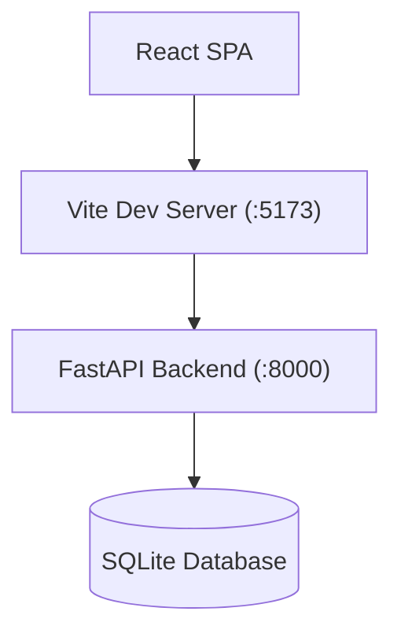

# Historic Stock Market Peak Analyzer

Academic-grade web application for comparative analysis of maximum subarray algorithms on financial time series.

## Overview

The Historic Stock Market Peak Analyzer is a platform that benchmarks classical subarray algorithms under identical conditions. It evaluates the performance of Brute Force, Divide & Conquer, and Kadane's algorithms when analyzing historical stock prices to maximize profit from a single buy and sell transaction.

## Features

- **Algorithm Benchmarking**: Compares Brute Force ($O(N^2)$), Divide & Conquer ($O(N \log N)$), and Kadane's Algorithm ($O(N)$).
- **Statistical Benchmark Engine**: Runs iterations to collect mean, median, min, max, and standard deviation statistics.
- **Smart Downsampling**: Built-in Largest-Triangle-Three-Buckets (LTTB) downsampling for large datasets.
- **Data Generation**: Generates synthetic geometric Brownian motion series.
- **Machine Learning Integration**: Framework for Isolation Forest, K-Means clustering, and Gradient Boosting.
- **Interactive API Documentation**: Auto-generated Swagger UI and ReDoc.

## Architecture



## Tech Stack

**Frontend**


**Backend**


## Prerequisites

- Node.js >= 18.0.0
- Python 3.12+

## Installation

### 1. Clone the Repository

```bash
git clone <repository-url>
cd DAA
```

### 2. Backend Setup

```bash
cd backend
python -m venv .venv

# Linux/macOS
source .venv/bin/activate
# Windows
.venv\Scripts\activate

pip install -r requirements.txt
```

### 3. Frontend Setup

```bash
cd ../frontend
npm install
```

## Configuration

The backend is configured via environment variables. You can create a `.env` file in the `backend/` directory.

| Variable                    | Required | Description                       | Default                                 |
| --------------------------- | -------- | --------------------------------- | --------------------------------------- |
| `APP_NAME`                | No       | Application metadata name         | `Historic Stock Market Peak Analyzer` |
| `DATABASE_URL`            | No       | SQLite connection string          | `sqlite:///./stock_analyzer.db`       |
| `MAX_BRUTE_FORCE_SIZE`    | No       | Algorithm Safety Limit            | `20000`                               |
| `MAX_DIVIDE_CONQUER_SIZE` | No       | Algorithm Safety Limit            | `100000`                              |
| `MAX_KADANE_SIZE`         | No       | Algorithm Safety Limit            | `1000000`                             |
| `BENCHMARK_ITERATIONS`    | No       | Number of benchmarking iterations | `10`                                  |
| `DOWNSAMPLE_THRESHOLD`    | No       | Trigger for LTTB downsampling     | `10000`                               |
| `DOWNSAMPLE_TARGET`       | No       | Target points after downsampling  | `5000`                                |

## Usage

### Starting the Backend

```bash
cd backend
# Make sure your virtual environment is activated
uvicorn main:app --reload --host 127.0.0.1 --port 8000
```

The API docs will be available at: [http://localhost:8000/api/v1/docs](http://localhost:8000/api/v1/docs)

### Starting the Frontend

Open a new terminal:

```bash
cd frontend
npm run dev
```

The web application will be available at: [http://localhost:5173](http://localhost:5173)

## Project Structure

```text
backend/     # FastAPI Python application, algorithms, and models
frontend/    # React Vite SPA, components, and pages
```

## Testing

The backend includes a test suite configured with `pytest` and `pytest-cov`. Test coverage is enforced to be at least 80%.

```bash
cd backend
pytest
```
