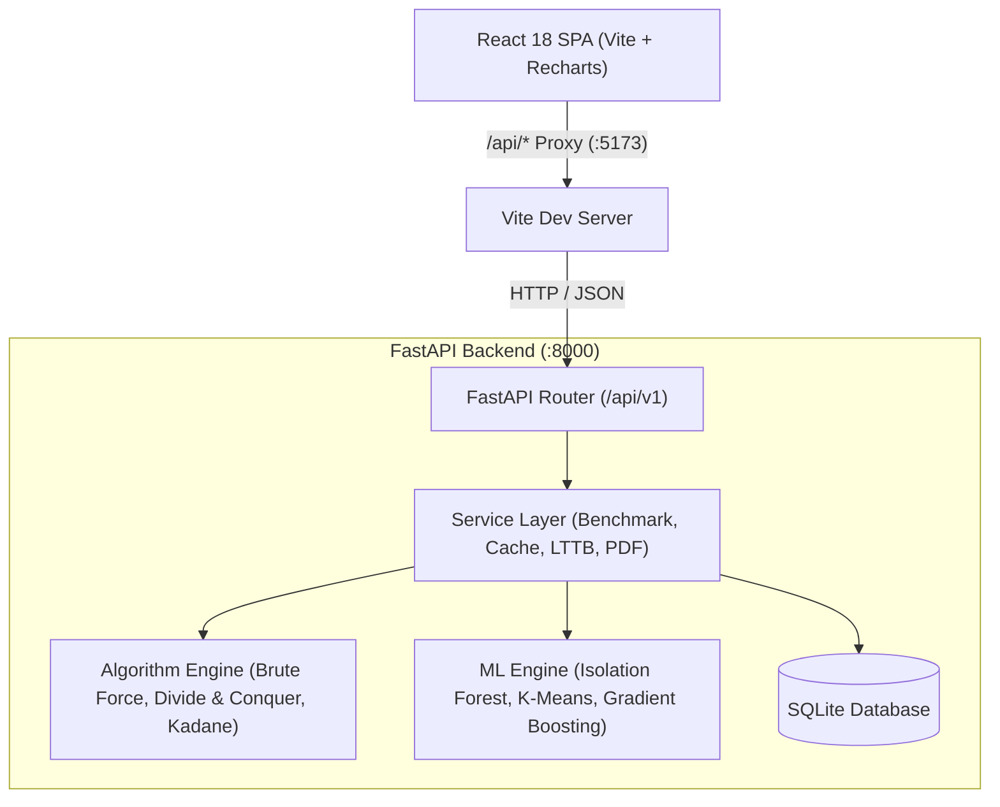

# Historic Stock Market Peak Analyzer

Benchmarking and visualization platform for Maximum Subarray algorithms on financial time series, featuring empirical complexity modeling and machine learning regime analytics.

## The Problem

Maximizing profit from a single buy and sell transaction on historical stock prices reduces to the Maximum Subarray Problem over consecutive daily differences ($\Delta[i] = P[i+1] - P[i]$). While theoretical asymptotic bounds ($O(N^2)$, $O(N \log N)$, and $O(N)$) are mathematically established, real-world performance is heavily affected by CPU cache locality, garbage collection, and memory allocation. This platform benchmarks classical subarray algorithms under identical conditions, verifies mathematical consistency across outputs, fits empirical growth curves against theoretical bounds, and layers machine learning models for market regime analysis.

## Table of Contents

- [Features](#features)
- [Prerequisites](#prerequisites)
- [Installation](#installation)
- [Quick Start](#quick-start)
- [Configuration](#configuration)
- [API Reference](#api-reference)
- [Architecture](#architecture)
- [Project Structure](#project-structure)
- [Algorithm Comparison](#algorithm-comparison)
- [Non-Goals](#non-goals)
- [Testing](#testing)
- [Contributing](#contributing)
- [License](#license)

## Features

- **Three Classical Subarray Algorithms**: Strategy Pattern implementations of Brute Force ($O(N^2)$), Divide & Conquer ($O(N \log N)$, CLRS §4.1), and Kadane's Algorithm ($O(N)$) with $10^{-6}$ profit cross-verification.
- **Statistical Benchmark Engine**: Multi-iteration runner collecting mean, median, min, max, and standard deviation for execution time and memory footprint (via `memory_profiler` and `psutil`).
- **Empirical Complexity Analysis**: Automated input sweeps ($N = 1\text{k}$ to $100\text{k}$) evaluating growth ratios and Big-O theoretical fitness scores ($[0.0, 1.0]$).
- **Dataset Generation & Ingestion**: Synthetic Geometric Brownian Motion series with 5 volatility profiles, plus CSV/XLSX file ingestion with column auto-detection.
- **Caching & Downsampling**: SHA-256 content-addressed caching for instant repeated lookups and Largest-Triangle-Three-Buckets (LTTB) downsampling for series exceeding 10,000 points.
- **Machine Learning Extensions**: Isolation Forest anomaly detection, K-Means market regime clustering, and Gradient Boosting buy/hold/sell signals over technical indicators.
- **PDF Export & OpenAPI Docs**: Automated multi-page academic PDF report generation via ReportLab and auto-generated Swagger UI.

## Prerequisites

- Python 3.12+
- Node.js >= 18.0.0
- npm

## Installation

```bash
# Clone the repository
git clone <repo-url>
cd DAA

# Backend setup
cd backend
python -m venv .venv
# Linux/macOS:
source .venv/bin/activate
# Windows (PowerShell):
.venv\Scripts\Activate.ps1
pip install -r requirements.txt

# Frontend setup
cd ../frontend
npm install
```

## Quick Start

### 1. Run the Full Application

Terminal 1 (Backend):

```bash
cd backend
uvicorn main:app --reload --host 127.0.0.1 --port 8000
```

Terminal 2 (Frontend):

```bash
cd frontend
npm run dev
```

Open `http://localhost:5173` in your browser. Interactive API documentation is available at `http://localhost:8000/api/v1/docs`.

### 2. Standalone Python Usage

```python
from algorithms.registry import ALGORITHM_REGISTRY

# Execute Kadane's Algorithm on a price series
algo = ALGORITHM_REGISTRY.get("Kadane's Algorithm")
result = algo.run([7.0, 1.0, 5.0, 3.0, 6.0, 4.0])

print(f"Buy Index: {result.buy_index}")    # 1 (price: 1.0)
print(f"Sell Index: {result.sell_index}")  # 4 (price: 6.0)
print(f"Profit: {result.max_profit}")      # 5.0
```

### 3. Direct API Request

```bash
curl -X POST "http://127.0.0.1:8000/api/v1/analyze" \
  -H "Content-Type: application/json" \
  -d '{
    "prices": [7.0, 1.0, 5.0, 3.0, 6.0, 4.0],
    "algorithms": ["Kadane'\''s Algorithm"]
  }'
```

## Configuration

Settings are managed in `backend/config.py`. Override defaults by setting environment variables or adding a `.env` file in `backend/`:

| Variable                    | Default                                                | Description                                        |
| --------------------------- | ------------------------------------------------------ | -------------------------------------------------- |
| `DATABASE_URL`            | `sqlite:///./stock_analyzer.db`                      | SQLite database connection string                  |
| `MAX_BRUTE_FORCE_SIZE`    | `20000`                                              | Input ceiling for$O(N^2)$ algorithm              |
| `MAX_DIVIDE_CONQUER_SIZE` | `100000`                                             | Input ceiling for$O(N \log N)$ algorithm         |
| `MAX_KADANE_SIZE`         | `1000000`                                            | Input ceiling for$O(N)$ algorithm                |
| `BENCHMARK_ITERATIONS`    | `10`                                                 | Iteration count per algorithm in benchmarks        |
| `DOWNSAMPLE_THRESHOLD`    | `10000`                                              | Point count threshold triggering LTTB downsampling |
| `DOWNSAMPLE_TARGET`       | `5000`                                               | Target point count after LTTB downsampling         |
| `CORS_ORIGINS`            | `["http://localhost:5173", "http://localhost:3000"]` | Allowed CORS origins for web client                |

## API Reference

Full schemas and request specifications are documented in [backend/docs/api_contract.md](backend/docs/api_contract.md). Interactive docs run at `http://localhost:8000/api/v1/docs`.

| Method   | Endpoint                        | Description                                                    |
| -------- | ------------------------------- | -------------------------------------------------------------- |
| `GET`  | `/api/v1/health`              | Service liveness probe and registered algorithm catalog        |
| `POST` | `/api/v1/datasets/generate`   | Generate synthetic price series with specified volatility      |
| `POST` | `/api/v1/datasets/upload`     | Upload CSV or XLSX dataset (50 MB limit)                       |
| `POST` | `/api/v1/analyze`             | Run selected algorithms on inline prices or persisted dataset  |
| `POST` | `/api/v1/benchmark`           | Launch asynchronous multi-iteration benchmark background task  |
| `POST` | `/api/v1/complexity/sweep`    | Trigger multi-size benchmark sweep for empirical curve fitting |
| `POST` | `/api/v1/ml/train`            | Launch asynchronous ML model training task                     |
| `GET`  | `/api/v1/report/dataset/{id}` | Download academic PDF report with charts and benchmark metrics |

## Architecture



See [backend/docs/architecture.md](backend/docs/architecture.md) for internal component details.

## Project Structure

```text
DAA/
├── backend/
│   ├── algorithms/     # Strategy Pattern implementations (Brute Force, D&C, Kadane)
│   ├── api/v1/         # FastAPI route handlers and request/response schemas
│   ├── database/       # SQLAlchemy models and SQLite connection setup
│   ├── docs/           # API contract and architecture documentation
│   ├── ml/             # Anomaly detection, regime classification, signal predictor
│   ├── services/       # Benchmarking, caching, downsampling, and PDF export
│   ├── tests/          # Pytest suite with coverage enforcement
│   ├── config.py       # Pydantic Settings configuration
│   ├── main.py         # Application factory and ASGI entry point
│   └── requirements.txt# Backend Python dependencies
└── frontend/
    ├── src/
    │   ├── api/        # Axios API client functions
    │   ├── components/ # Chart, modal, and presentation components
    │   ├── pages/      # Dashboard, Benchmark, Complexity, and ML views
    │   └── App.jsx     # Root application component and routing
    ├── package.json    # Frontend dependencies and npm scripts
    └── vite.config.js  # Vite server and reverse proxy configuration
```

## Algorithm Comparison

| Algorithm                    | Strategy                            | Time Complexity | Space Complexity | Safe Input Limit |
| ---------------------------- | ----------------------------------- | --------------- | ---------------- | ---------------- |
| **Brute Force**        | Exhaustive pair search              | $O(N^2)$      | $O(1)$         | 20,000           |
| **Divide & Conquer**   | Recursive partitioning (CLRS §4.1) | $O(N \log N)$ | $O(\log N)$    | 100,000          |
| **Kadane's Algorithm** | Dynamic programming state tracking  | $O(N)$        | $O(1)$         | 1,000,000+       |

## Non-Goals

- **Brokerage Order Execution**: Does not place market orders or integrate with external brokerage accounts; designed for algorithm analysis and historical simulation.
- **Distributed Computing**: Runs as a single-node application using embedded SQLite and local worker threads, not a distributed streaming cluster.

## Testing

Run the backend test suite:

```bash
cd backend
pytest
```

Coverage is enforced at 80% minimum across non-test modules via `backend/pytest.ini`.

## Contributing

1. Run `pytest` inside `backend/` and confirm all tests pass with at least 80% coverage.
2. Adhere to PEP 8 standards for Python and modular component structure for React.
3. Submit a pull request detailing the changes and any computational or algorithmic implications.

## License

Declared as MIT in `backend/main.py`. (No separate `LICENSE` file is present in the repository).
